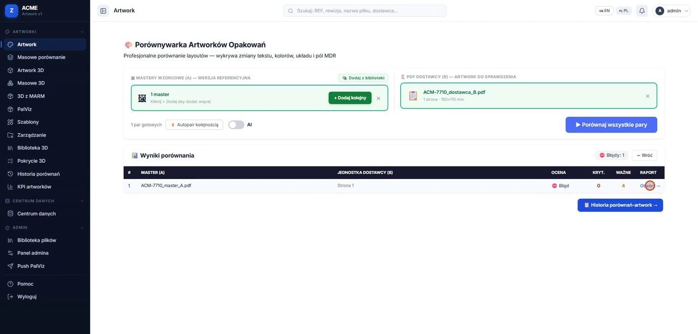

# Artwork — porównywanie projektów opakowań



Aplikacja Flask dla działów zakupów i jakości, która porównuje projekty opakowań (PDF)
od dostawców z wzorcami i wyłapuje różnice w kodach kreskowych, datach, nazwach i wersjach,
zanim trafią na towar.

> **Projekt portfolio.** Nazwy firm są zamienione na fikcyjne, a dane demo i testowe są syntetyczne.
>
> Kod udostępniony do wglądu (portfolio), wszelkie prawa zastrzeżone — patrz [`LICENSE`](LICENSE).
> Historia commitów została zgnieciona przy anonimizacji wersji portfolio.

[](https://github.com/TomaszWu14/artwork-checker/actions/workflows/ci.yml)

Porównuje artworki z masterami, waliduje kody kreskowe (EAN/GS1), prowadzi indeks masterów
z wersjonowaniem i renderuje opakowania w 3D. Wydzielona z większego systemu porównywania
dokumentów (PO/PI/CI).

## W skrócie

| | |
|---|---|
| **Problem** | Ręczne porównywanie projektów opakowań od dostawców z wzorcami — błędy w kodach kreskowych, datach, nazwach i wersjach wychodziły dopiero na towarze. |
| **Rozwiązanie** | Porównanie strefowe PDF (tekst + obraz), walidacja GS1/EAN, indeks masterów z historią wersji, raport różnic (PDF/Excel), podgląd 3D opakowania. |
| **Stack** | Python, Flask, pdfplumber + PyMuPDF + camelot (PDF), RapidOCR/Tesseract (OCR), PostgreSQL/SQLite, gunicorn, Docker; frontend: szablony Jinja + JS (pdf.js, three.js). |
| **Jakość** | ~450 testów (`pytest tests/`), CI w GitHub Actions, skany bezpieczeństwa. |

## Uruchomienie (szybki start)

Lekki zestaw — te same zależności co w CI, wystarczy do testów:

```bash
python -m venv .venv
.venv\Scripts\activate          # Linux/macOS: source .venv/bin/activate
pip install pytest python-dateutil dateparser babel flask werkzeug "rapidfuzz>=3.0,<4.0"
python -m pytest tests/ -q      # ~410 testów, część pomijana bez bibliotek PDF/OCR
```

Pełna aplikacja (parsowanie PDF, OCR, eksport) — zestaw bez ciężkich pakietów ML:

```bash
pip install -r requirements-prod.txt   # pełny requirements.txt dokłada opcjonalne silniki ML
python migrate_db.py                   # baza SQLite w instance/
python app.py                          # http://localhost:5000
```

**Konto:** przy pierwszym starcie aplikacja zakłada tylko konto `admin` z **losowym hasłem** —
wypisuje je w konsoli i zapisuje do pliku `INITIAL_ADMIN_PASSWORD.txt` w katalogu projektu
(plik jest w `.gitignore`). Zaloguj się, zmień hasło i usuń ten plik. Kolejne konta zakłada
administrator w aplikacji.

Opcjonalnie: Tesseract (OCR) i Ghostscript poprawiają jakość parsowania PDF.

## Mój wkład

Projekt w całości mojego autorstwa (jedyny twórca) — od analizy procesu w dziale po wdrożenie.

- Silnik porównania artwork ↔ master: ekstrakcja tekstu z pozycjami, porównanie strefowe
  (tekst + obraz) i kaskada OCR dla tekstu zamienionego na krzywe.
- Walidacja GS1: sumy kontrolne EAN/UPC/GTIN, odczyt kodów z obrazu i zgodność kodu z tekstem.
- Raport różnic z listą kontrolną elementów obowiązkowych (REF, LOT, EXP, CE…) i eksportem PDF/Excel.
- Indeks masterów z historią wersji oraz podgląd 3D opakowania z wykrojnika (three.js).

## Dlaczego ten stack

Flask i szablony Jinja wystarczają dla wewnętrznego narzędzia kilkunastu osób i nie wymagają
osobnego frontendu. pdfplumber daje tekst z pozycjami (podstawa porównania strefowego),
a PyMuPDF szybko renderuje strony do porównania obrazów. Część artworków ma tekst zamieniony
na krzywe, więc jest kaskada OCR (RapidOCR na CPU, Tesseract jako zapas), a ciężkie modele ML
są opcjonalne i ładowane leniwie. SQLite wystarcza lokalnie, PostgreSQL na produkcji.

## Ograniczenia i co dalej

- `app.py` ma ~12,8 tys. linii, a `artwork_comparator.py` ~7,5 tys. — do podziału na blueprinty
  i mniejsze moduły.
- Jakość porównania zależy od PDF: skany i tekst na krzywych przechodzą przez OCR, który myli
  znaki (0/O, 1/I) — wynik wymaga potwierdzenia przez człowieka.
- Testy pokrywają głównie czystą logikę (walidacja kodów, normalizacja, raport); pełny przebieg
  PDF → raport jest testowany wąsko.
- Pełna instalacja jest ciężka (OpenCV, camelot, opcjonalnie modele ML) — obraz Dockera zamiast
  lokalnej instalacji.
- Pozostałości nazwy systemu-matki (DocCompare) w komunikatach startowych.

## Gdzie zacząć czytać kod

1. [`artwork_comparator.py` — `compare_artworks`](artwork_comparator.py#L7068) — wejście do porównania pary PDF.
2. [`barcode_validator.py` — `validate_artwork_barcodes`](barcode_validator.py#L576) — sumy kontrolne i zgodność kodów.
3. [`artwork_report_engine.py`](artwork_report_engine.py) — raport różnic i lista kontrolna.

## Wideo

Wkrótce (YouTube) — porównanie pary artworków, lista kontrolna i podgląd 3D.

## Struktura

| Plik / katalog | Rola |
|---|---|
| `app.py` | aplikacja Flask (trasy, widoki) |
| `artwork_comparator.py`, `artwork_zone_comparator.py` | porównanie artwork ↔ master |
| `barcode_validator.py` | walidacja EAN/GS1 i dat |
| `artwork_index.py`, `artwork_naming.py` | indeks masterów, nazewnictwo wersji |
| `artwork_3d.py`, `dieline_templates.py` | wykrojniki i podgląd 3D |
| `export_engine.py`, `artwork_report_engine.py` | raporty PDF/Excel |
| `templates/`, `static/` | interfejs |
| `tests/` | testy pytest |

## Testy

```bash
python -m pytest tests/ -q      # zależności jak w CI — patrz „Uruchomienie (szybki start)”
```
